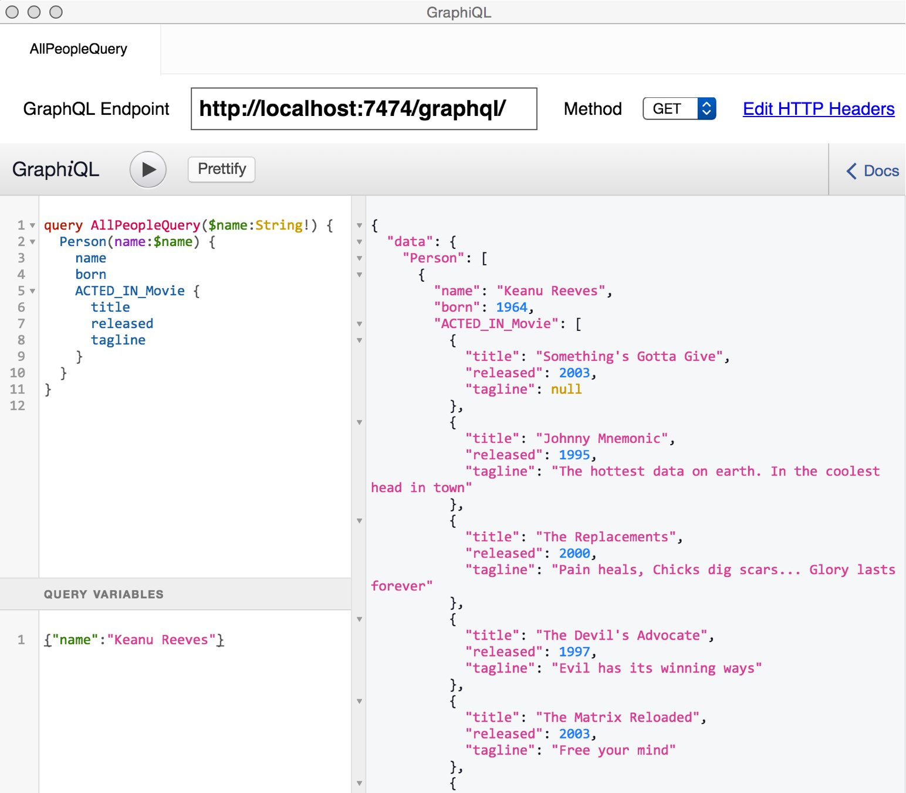
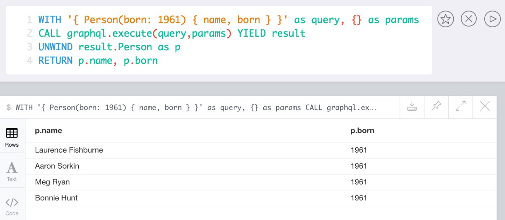

= Neo4j-GraphQL Extension

image:https://travis-ci.org/neo4j-contrib/neo4j-graphql.svg?branch=master["Build Status", link="https://travis-ci.org/neo4j-contrib/neo4j-graphql"]

NOTE: This is an very early version of GraphQL support for Neo4j.

This implementation provides a GraphQL API to Neo4j, it comes as library but can also be installed as Neo4j server extension
to act as a GraphQL endpoint. It turns GraphQL queries and mutations into Cypher statements and executes them on Neo4j.

We want to explore three approaches:

1. read schema / metadata from the database provide GraphQL DataFetcher that generate and run Cypher (WIP) √
2. make the same work with externally configured schema information (using IDL) √
3. do a direct GraphQL AST to Cypher transformation without bothering with Schema (TBD)

== License

Apache License v2

== Schema

=== IDL

You can post GraphQL IDL schema to the `/graphql/idl` endpoint which is parsed and stored in the graph.
That schema is then used as graphql-schema for validating and executing queries.

Also mutations for each type are created, which return the executed graph operations.
e.g.

* `createMovie(title: String!, released: Int, tagline: String)` and
* `addMoviePersons(title: String!, persons:[String]!)`

Those mutations then allow you to create graph data with GraphQL.

=== Schema from Graph

The library samples the existing data and adds one GraphQLObject for each Node-Label with all the properties and their types found as outputs and input-arguments.

Relationship information is collected with direction, type, end-node-labels and degree (to determine single element or collection result).
// Additional labels on a node are added as GraphQLInterface's.
Each relationship-type virtual property to the node type, named `aType` for `A_TYPE`.
// Each relationship-type and end-node label is added as a virtual property to the node type, named `TYPE_Label` for outgoing and `Label_TYPE` for incoming relationships.

== Installation

The current version of this extension works with Neo4j 3.0 and 3.1

----
git clone https://github.com/neo4j-contrib/neo4j-graphql
cd neo4j-graphql
mvn clean package
cp target/neo4j-graphql-1.0-SNAPSHOT.jar $NEO4J_HOME/plugins
echo 'dbms.unmanaged_extension_classes=org.neo4j.graphql=/graphql' >> $NEO4J_HOME/config/neo4j.conf
$NEO4J_HOME/bin/neo4j restart
----

== Features

[options=header,cols="a,2a,3m"]
|===
| name | information | example
| entities | each node label represented as entity | { User {name,age} }
| multi entities | multiple entities per query turned into `UNION` | { User {name,age} City {name,geo} }
| properties (out) | via sampling property names and types are determined | { City {name,geo} }
| properties (in) | all properties can be used as filtering (exact/list) input parameters, will be turned into Cypher parameters | { City(name:"Berlin") {name,geo} }
| parameters | passed through as Cypher parameters | query UserQuery ($name: String!) { User(name:$name) {name,age} }
| relationships (out) | via a `RELTYPE_Label` nested field | { User { name, LIVES_IN_City {name} } }
| relationships (in) | via a `Label_RELTYPE` nested field | { City { name, User_LIVES_IN { name } } }
| ordering | via an extra `orderBy` input field | query UserSortQuery { User(orderBy:[name_desc,age_desc]) {name,age}}
| directive | directives control cypher prefixes, *note that directives have to be set at the first entity* |
| directive - query plan | `@profile / @explain` will be returned in extra field `extensions` | query UserQuery { User @profile {name} }

// | directive - version | set cypher version to use `@version(3.0,3.1,3.2)` | query UserQuery { User @version(3.0) {name} }
// | directive - compiled runtime  | force compiled runtime to be used | query UserQuery { User @compile {name} }
| extensions | extra information returned | fields are: columns, query, warnings, plan, type READ_ONLY/READ_WRITE,
| IDL | define schema via IDL | :POST /graphql/idl "type Person {name: String!, born: Int}"
| Mutations | mutations are created from the schema | "create" mutations for each type and relationship
|===

== Usage

Run `:play movies` in your Neo4j Server, click the statement and run it to insert the basic movie graph.

== GraphiQL

Get GraphiQL electron app from: https://github.com/skevy/graphiql-app

If your Neo4j Server runs with auth enabled, add the appropriate Basic-Auth header in the "Edit HTTP Headers" screen.

----
echo "Authorization: Basic $(echo -n "neo4j:<password>" | base64)"
----

And then run a query like:

----
query AllPeopleQuery {
  Person(name:"Kevin Bacon") {
    name
    born
    actedIn {
      title
      released
      tagline
    }
  }
}
----

You can also use variables or query the schema:

.Which types are in the schema
----
{
  __schema {
    types {
      name
      kind
      description
    }
  }
}
----

or

.Which types are available for querying
----
{
  __schema {
    queryType {
      fields { name, description }
    }
  }
}
----

and then query for real data

----
# query
query PersonQuery($name: String!) {
  Person(name: $name) {
    name
    born
    actedIn {
      title
      released
      tagline
    }
  }
}
# variables
{"name":"Keanu Reeves"}
----

== Procedure

This library also comes with a User Defined Procedure to execute GraphQL:

[source,cypher]
----
WITH '{ Person(born: 1961) { name, born } }' as query, {} as params

CALL graphql.execute(query,params) YIELD result

UNWIND result.Person as p
RETURN p.name, p.born
----

== Examples

Some more examples

.Relationship Argument
----
query MoviePersonQuery {
  Movie {
    title
    actedIn(name:"Tom Hanks") {
      name
    }
  }
}
----

.Nested Relationships
----
query PersonMoviePersonQuery {
  Person {
    name
    actedIn {
      title
      actedIn {
        name
      }
    }
  }
}
----

.Sorting
----
query PersonQuery {
  Person(orderBy: [age_asc, name_desc]) {
    name
    born
  }
}
----

== CURL

=== POST IDL
_(Optional if no data in database)_

----
curl  -u neo4j:<password> -i -XPOST -d'type Person { name: String, born: Int }' http://localhost:7474/graphql/idl/

{Person=MetaData{type='Person', ids=[], indexed=[], properties={name=PropertyType(name=String, array=false, nonNull=false), born=PropertyType(name=Int, array=false, nonNull=false)}, labels=[], relationships={}}}
----

=== Query the Schema

----
curl  -u neo4j:<password> -i -XPOST -d'{"query": "query {__schema {types {kind, name, description}}}"}' -H accept:application/json -H content-type:application/json http://localhost:7474/graphql/

{"data":{"__schema":{"types":[{"kind":"OBJECT","name":"QueryType","description":null},{"kind":"OBJECT","name":"Movie","description":"Movie-Node"},....
----

----
query {__schema {queryType {
  kind,description,fields {
    name
  }
}}}
----

=== Get All People

----
curl  -u neo4j:<password>  -i -XPOST -d'{"query": "query AllPeopleQuery { Person {name,born} } }"}' -H accept:application/json -H content-type:application/json http://localhost:7474/graphql/

HTTP/1.1 200 OK
Date: Mon, 24 Oct 2016 21:40:15 GMT
Content-Type: application/json
Access-Control-Allow-Origin: *
Transfer-Encoding: chunked
Server: Jetty(9.2.9.v20150224)

{"data":{"Person":[{"name":"Michael Sheen","born":1969},{"name":"Jack Nicholson","born":1937},{"name":"Nathan Lane","born":1956},{"name":"Philip Seymour Hoffman","born":1967},{"name":"Noah Wyle","born":1971},{"name":"Rosie O'Donnell","born":1962},{"name":"Greg Kinnear","born":1963},{"name":"Susan Sarandon","born":1946},{"name":"Takeshi Kitano","born":1947},{"name":"Gary Sinise","born":1955},{"name":"John Goodman","born":1960},{"name":"Christina Ricci","born":1980},{"name":"Jay Mohr","born":1970},{"name":"Ben Miles","born":1967},{"name":"Carrie Fisher","born":1956},{"name":"Christopher Guest","born":1948},{"name
...
----

=== Get one Person by name with Parameter

----
curl  -u neo4j:<password> -i -XPOST -d'{"query":"query PersonQuery($name:String!) { Person(name:$name) {name,born} }", "variables":{"name":"Kevin Bacon"}}' -H content-type:application/json http://localhost:7474/graphql/

HTTP/1.1 200 OK
Date: Mon, 24 Oct 2016 21:40:38 GMT
Content-Type: application/json
Access-Control-Allow-Origin: *
Transfer-Encoding: chunked
Server: Jetty(9.2.9.v20150224)

{"data":{"Person":[{"name":"Kevin Bacon","born":1958}]}}
----

=== Get one Person by name literal with related movies

----
curl  -u neo4j:<password> -i -XPOST -d'{"query":"query PersonQuery { Person(name:\"Tom Hanks\") {name, born, actedIn {title, released} } }"}' -H content-type:application/json http://localhost:7474/graphql/
HTTP/1.1 200 OK
Date: Tue, 25 Oct 2016 03:17:08 GMT
Content-Type: application/json
Access-Control-Allow-Origin: *
Transfer-Encoding: chunked
Server: Jetty(9.2.9.v20150224)

{"data":{"Person":[{"name":"Tom Hanks","born":1956,"actedIn":[{"title":"Charlie Wilson's War","released":2007},{"title":"A League of Their Own","released":1992},{"title":"The Polar Express","released":2004},{"title":"The Green Mile","released":1999},{"title":"Cast Away","released":2000},{"title":"Apollo 13","released":1995},{"title":"The Da Vinci Code","released":2006},{"title":"Cloud Atlas","released":2012},{"title":"Joe Versus the Volcano","released":1990},{"title":"Sleepless in Seattle","released":1993},{"title":"You've Got Mail","released":1998},{"title":"That Thing You Do","released":1996}]}]}}
----

== Resources

* https://github.com/graphql-java/graphql-java[GraphQL-Java] which we use in this project

* https://github.com/solidsnack/GraphpostgresQL[GraphQL for Postgres] as an inspiration of schema -> native queries
* https://github.com/jhwoodward/neo4j-graphQL[Schema Based GraphQL to Cypher in JavaScript]
* https://github.com/jameskyburz/graphqlcypherquery[GraphQL to Cypher translator (w/o schema)]
** https://github.com/JamesKyburz/graphql2cypher[GraphQL parser to Cypher]

* https://neo4j.com/blog/cypher-graphql-neo4j-3-1-preview/[GraphQL inspired Cypher features] Map projections and Pattern comprehensions
* https://github.com/facebook/dataloader

* https://github.com/skevy/graphiql-app[GraphiQL Electron App]
* http://graphql.org/learn/serving-over-http/[Serving over HTTP]

* https://facebook.github.io/graphq[GraphQL Specification]
////
echo "Authorization: Basic $(echo -n "neo4j:test" | base64)"
"Authorization: Basic bmVvNGo6dGVzdA=="
////

== TODO

* Non-Null and Nullable Input and Output Types
* https://www.reindex.io/docs/graphql-api/connections/#connection-arguments[Pagination]: Skip and Limit (first,last,after,before,skip,limit)
* √ https://www.reindex.io/docs/graphql-api/connections/#orderby[orderBy] with enum _PersonOrdering { name_asc,name_desc,... }
* https://www.reindex.io/docs/graphql-api/connections/#filtering[Filtering] with support of a object argument for an input-argument-field, with key=comparator, and value compare-value +
  `(status: {eq/neq:true}, createdAt: { gte: "2016-01-01", lt: "2016-02-01"}, tags: {isNull:false, includes/excludes: "foo"})`
* Handle result aggregation.
* How to handle Geospatial and other complex input types
* √ Support for Directives, e.g. to specify the cypher compiler or runtime? or special handling for certain fields or types
* √ Add `extensions` result value for query statistics or query plan, depending on directives given, e.g. contain the generated cypher query as well
* @skip, @include directives, check if they are handled by the library
* handle nested relationships as optional or non-optional (perhaps via nullable?) or directive
* √ project non-found nested results as null vs. map with null-value entries
* https://facebook.github.io/relay/docs/graphql-connections.html#content[Connection] add support for edges / nodes special properties
* Support 3.1 via pattern comprehensions and map projections
